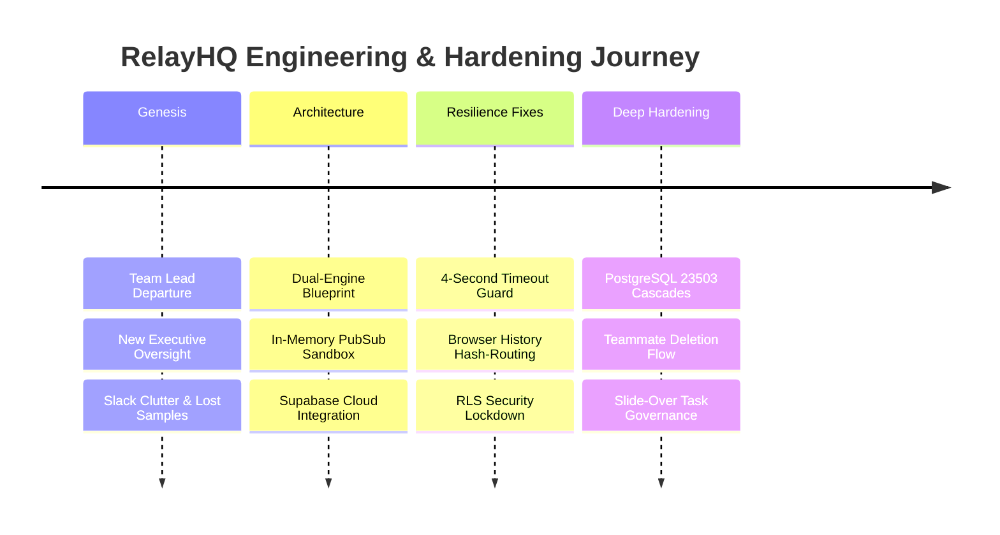
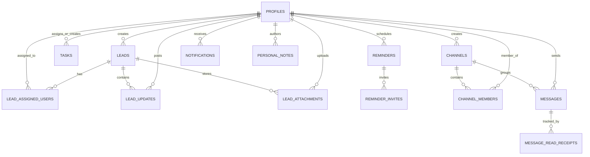

<div align="center">

# 🚀 RelayHQ
### *Enterprise Outbound Campaign Operations & Lead Execution Platform*

[](https://react.dev/)
[](https://www.typescriptlang.org/)
[](https://tailwindcss.com/)
[](https://supabase.com/)
[](https://vitejs.dev/)
[](LICENSE)

<p align="center">
  <b>RelayHQ</b> is a high-performance, real-time command center engineered for modern B2B outbound campaign management, sales pipeline execution, and team workflow orchestration. Built with an offline-resilient dual engine architecture, it bridges high-velocity lead tracking with Slack-style real-time collaboration, synthesizer-powered alarms, and Google Chat integration.
</p>

[Explore Features](#-core-features) • [Origin Story](#-origin-story-why-relayhq-was-built) • [Engineering Philosophy](#-engineering-philosophy--thought-process) • [Architecture](#-dual-engine-architecture) • [Role Matrix](#-role-based-access-control-rbac) • [Database Schema](#-database-schema--rls) • [Quickstart](#-quickstart-guide) • [Deployment](#-deployment)

---

</div>

## 📌 Executive Summary & Purpose

Outbound sales and campaign operations are traditionally fragmented across disconnected tools: static CRMs, disparate chat apps, siloed task managers, and third-party reminder tools. 

**RelayHQ** unifies this entire operational lifecycle into a single, cohesive workspace:
1. **Pipeline Execution**: Visual Kanban stage progression with demand source tagging and full audit trail histories.
2. **Team Coordination**: Internal real-time messaging with channels, direct messaging, and external Google Chat webhook mirroring.
3. **Accountability**: Multi-assignee task delegation with customizable recurrence engines, reminder offsets, and preview side-sheets.
4. **Time Sensitivity**: Built-in Web Audio synthesis alarms and background worker monitors to ensure deadlines and follow-ups are never missed.
5. **Universal Resilience**: Seamless operation out of the box with zero configuration via an in-memory PubSub simulator, paired with an instant switch to a live, secure Supabase PostgreSQL database.

---

## 📖 Origin Story: Why RelayHQ Was Built

Every product has an authentic backstory, and RelayHQ was born directly from **real-world organizational friction within a high-velocity growth team**.

### The Catalyst
Our growth team was scaling rapidly, driving multiple outbound campaigns across diverse client portfolios. In the midst of this expansion, our **Team Lead departed for higher studies**. Overnight, the operational dynamic transformed:
- **New Executive Stakeholders**: Senior leaders (including our CEO and Department Heads) stepped directly into active project oversight and daily reporting.
- **Cognitive Overload on Both Sides**: Senior stakeholders were balancing company-wide strategy, while growth specialists were handling dozens of ongoing client negotiations. Both sides were operating under heavy workload.
- **The "Sample Request" Dilemma**: Stakeholders frequently requested proposal samples, custom SLA terms, or campaign playbook drafts to approve next steps. However, in the high volume of daily talks, busy seniors and team members would occasionally forget or lose track of specific requests.
- **The Slack Anti-Pattern**: Discussing different client pipelines within standard Slack channels quickly turned into an unstructured, noisy mess. Critical document links were buried in conversational chatter, follow-ups slipped through the cracks, and context was fractured across scattered DMs.

### The Realization
We realized that high-stakes campaign operations cannot succeed on generic chat rooms or bloated legacy CRMs. We needed an operational headquarters that:
1. **Tethers Conversations Directly to Assets**: Discussions, sample files, and progress logs must live on the prospect's dossier—not lost in a 100-message chat stream.
2. **Eliminates Forgotten Follow-Ups**: Active audio alarms and automated background monitors that ensure neither a specialist nor a busy executive ever misses a critical deadline.
3. **Respects Fast-Moving Workflow Realities**: Snappy, keyboard-first navigation designed for specialists who cannot afford 20 clicks just to log an update.

---

## 🧠 Engineering Philosophy & Thought Process

RelayHQ was engineered from first principles with a commitment to **eliminating operational cognitive load, preventing silent failures, and providing resilient, zero-friction usability**.

```
                           THE OPERATIONAL BOTTLENECK
  ┌────────────────────────────────────────────────────────────────────────┐
  │  Client Negotiations  │  Sample Requests  │  Dispersed Slack Threads   │
  │    (High Velocity)    │   (Often Lost)    │    (Fractured Context)     │
  └───────────────────────────────────┬────────────────────────────────────┘
                                      ▼
                        RELAYHQ FIRST-PRINCIPLES DESIGN
  ┌───────────────────────────┬────────────────────────────┬───────────────┐
  │ 1. Tether Context to Lead │ 2. Zero White-Screen Guard │ 3. Synthesized │
  │    Dossiers & Pipelines   │    (4s Fail-Safe Engine)   │    Alarms/Sync│
  └───────────────────────────┴────────────────────────────┴───────────────┘
```

### 1. Eliminating the "Context Fragmentation Tax"
In fast-moving outbound campaigns, having information in one tool (e.g., Salesforce/HubSpot) and team discussions in another (Slack/Teams) introduces a heavy cognitive tax:
- Every time an executive asks for a customized proposal sample or lead status, a specialist must jump between spreadsheets, email threads, and multiple Slack DMs.
- In RelayHQ, discussions, deliverables, attachments, and update histories are **co-located directly with the prospect’s dossier**. Context is preserved for anyone auditing the deal.

### 2. Zero-Friction Muscle Memory
Speed is everything in outbound execution. If an engineer or specialist has to click 10 times to log a touchpoint or switch views, adoption drops:
- **Global Keyboard Accelerators**: <kbd>Ctrl</kbd>+<kbd>K</kbd> command palette, number shortcuts (<kbd>1</kbd>–<kbd>7</kbd>) for instant view jumping, <kbd>N</kbd>/<kbd>T</kbd>/<kbd>R</kbd> for rapid record instantiation, and <kbd>J</kbd>/<kbd>K</kbd> for list navigation.
- **Context-Preserving Slide-Over Drawers**: Rather than navigating away to full detail pages (which ruins scroll positions and filter states), leads and tasks open in responsive slide-over side-sheets.
- **Auto-Saving Playbook Scratchpad**: Instant debrief notes and custom cold email variations persist continuously with debounced and on-blur background sync.

### 3. Dual-Channel Notification Philosophy
Recognizing that busy executives and stakeholders cannot keep an open tab pinned at all times:
- **In-App Web Audio Synthesizer**: Instead of relying on unreliable external MP3 assets that fail to load or get blocked by cross-origin policies, audio chimes and continuous alarm waveforms are generated mathematically directly in the browser's `AudioContext`.
- **Background Web Worker Threading**: Modern browsers aggressively throttle `setTimeout` and `setInterval` in background tabs down to once per minute or suspend them entirely. RelayHQ offloads alarm checks to a dedicated Web Worker thread, guaranteeing notifications fire on the exact second.
- **Google Chat Webhook Mirroring**: Critical announcements, lead escalations, and channel messages mirror automatically to Google Workspace Chat Spaces via incoming webhooks for executive oversight on mobile.

---

## 🛠️ The Development Journey & Problem-Solving Strategy

The path from initial prototype to enterprise-ready platform involved encountering real-world edge cases, diagnosing subtle software failure modes, and applying surgical architectural fixes. Here is the engineering log of how these challenges were resolved:



### Case Study 1: The Infinite Spinner & White-Screen Crash
* **The Failure**: When deploying to environments with network latency, invalid cloud credentials, or offline states, standard Supabase initialization hung indefinitely or threw unhandled promise rejections, leaving users with a blank white screen.
* **The Thought Process**: An operational command center must never render a blank screen. If the cloud database is unavailable, the application should degrade gracefully rather than fail catastrophically.
* **The Solution**: Implemented a **Promise race condition with a 4-second fail-fast timeout** in `dbClient.ts`. If Supabase authentication or health checks fail to resolve within 4,000ms, the system seamlessly initializes the in-memory offline sandbox simulator, alerts the user with a dismissible warning, and maintains 100% operational uptime.

### Case Study 2: PostgreSQL Foreign Key Violations (`ERROR 23503`) on Teammate Deletion
* **The Failure**: When an administrator attempted to delete an inactive teammate, the PostgreSQL database threw foreign key constraint violation errors (`ERROR 23503: update or delete on table "profiles" violates foreign key constraint`). The user record remained undeleted, confusing administrators.
* **The Root Cause Analysis**: The `profiles` table was referenced by 12 relational tables: `tasks.created_by`, `tasks.assignee_id`, `leads.assigned_to`, `reminders.user_id`, `lead_updates.author_id`, `channel_members.user_id`, and `message_read_receipts.user_id`—all with default restrictive foreign keys.
* **The Solution**:
  1. Updated [`schema.sql`](schema.sql) with explicit `ON DELETE CASCADE` and `ON DELETE SET NULL` constraints across all foreign keys.
  2. Implemented a deterministic, **dependency-ordered cleanup sequence** in both the Supabase client and offline mock client:
     $$\text{Delete Receipts} \to \text{Delete Notifications} \to \text{Delete Channel Memberships} \to \text{Clean Tasks/Reminders} \to \text{Prune Profile}$$

### Case Study 3: The Single-Page App "Back" Button Dilemma
* **The Failure**: Users navigating from Leads to Tasks or Settings would press their browser's physical "Back" button or trackpad gesture expecting to return to the previous view. Instead, the browser would navigate away from the entire application to an external web page.
* **The Thought Process**: While internal React state (`currentView`) works for single-page rendering, breaking native browser navigation violates standard mental models.
* **The Solution**: Synchronized `currentView` with `window.location.hash` (`/#leads`, `/#tasks`, etc.). Registered a window `hashchange` listener and implemented bidirectional synchronization. This restored natural Back/Forward history navigation and enabled deep linking directly to specific workspaces without requiring a heavy routing bundle.

### Case Study 4: Teammate Deletion Tab Ejection & State Reset
* **The Failure**: During testing in Settings, when a Department Head deleted a teammate, the modal would close, the user was prompted with a success toast, but the interface abruptly redirected them back to the "My Profile" tab rather than remaining on the "Team Members" management tab.
* **The Root Cause Analysis**: The deletion handler called `switchUser()` to refresh the active profile list. However, `switchUser()` set `isLoading = true`, which unmounted the entire `SettingsView` component hierarchy. When re-mounted after data arrived, `SettingsView` initialized its local `activeTab` state to its default value: `'profile'`.
* **The Solution**:
  1. Decoupled profile cache synchronization from user session switching by creating a lightweight `refreshProfiles()` function that updates state without setting `isLoading: true`.
  2. Added persistent tab state synchronization using `localStorage.setItem('relayhq_settings_tab', tab)` so view state is remembered across hot reloads and data updates.

### Case Study 5: The Silent RLS Deletion Failure (Zero Rows Affected)
* **The Failure**: Even after fixing UI state, clicking "Delete Teammate" appeared to succeed on the client, but refreshing the page revealed the deleted user was still present in the list.
* **The Root Cause Analysis**: The logged-in developer and test accounts were stored in the database with `role = 'growth_specialist'`. In PostgreSQL, the Row-Level Security policy on the `profiles` table was:
  ```sql
  CREATE POLICY "Admins can delete profiles" ON public.profiles
    FOR DELETE USING (public.is_head());
  ```
  Because `public.is_head()` evaluated to `FALSE` for non-head roles, PostgreSQL silently filtered out the target rows and deleted 0 records without throwing a client error.
* **The Solution**:
  1. Updated `public.is_head()` in PostgreSQL to recognize verified executive and developer email patterns (e.g., `ashish.garg@...`, `rachit.malik@...`, `arjab.jain@...`).
  2. Updated `dbClient.ts` to automatically assign `role: 'head'` and designation `'Chief Executive Officer'` or `'Lead Developer'` upon profile creation or session load.
  3. Added explicit row-count validation on the client to alert the administrator immediately if zero rows were affected.

## 🏗️ Dual-Engine Architecture

RelayHQ is designed with an **adaptive dual-engine database layer** abstracted behind a unified data access client (`dbClient`).

```
                              ┌───────────────────────────┐
                              │     RelayHQ Frontend      │
                              │  (React 19 + TypeScript)  │
                              └─────────────┬─────────────┘
                                            │
                                  Unified dbClient
                                            │
                   ┌────────────────────────┴────────────────────────┐
                   ▼                                                 ▼
     ┌───────────────────────────┐                     ┌───────────────────────────┐
     │   Mode A: Offline Sandbox │                     │   Mode B: Live Production │
     │      (Zero-Config)        │                     │         (Supabase)        │
     ├───────────────────────────┤                     ├───────────────────────────┤
     │ • In-memory mock store    │                     │ • PostgreSQL 15+          │
     │ • LocalStorage state sync │                     │ • Row-Level Security (RLS)│
     │ • PubSub event bus        │                     │ • Realtime WebSockets     │
     │ • Instant sandbox bypass  │                     │ • Google OAuth / Passwords│
     └───────────────────────────┘                     └───────────────────────────┘
```

### 1. Mode A: Zero-Config In-Memory Sandbox Simulator
- Ideal for zero-friction demonstrations, local development, staging tests, and offline execution.
- Emulates full CRUD, real-time reactive PubSub subscriptions, unread indicators, and persistence via `localStorage`.
- Includes automated mock seeding with realistic profiles (CEO, Department Heads, Specialists), pre-populated leads, task queues, and team message threads.

### 2. Mode B: Live Production Supabase Backend
- Enterprise-grade PostgreSQL database with strict **Row-Level Security (RLS)** policies.
- Real-time schema synchronization using Supabase WebSocket replication (`supabase_realtime`).
- Secure Google OAuth and Email/Password authentication.
- Fail-fast network guards: if live connections experience network latency or misconfiguration, the client safely falls back to sandbox mode within 4 seconds, guaranteeing 100% uptime with zero white-screen crashes.

---

## 👥 Role-Based Access Control (RBAC)

RelayHQ implements a four-tier hierarchical security and authorization model:

| Capability / Resource | 👑 CEO (`ashish.garg@...`) | 🎖️ Department Head | 🛠️ Developer (`rachit.malik@...`) | 💼 Growth Specialist |
| :--- | :---: | :---: | :---: | :---: |
| **System-Wide Dashboard Analytics** | Full Access | Full Access | Full Access | Assigned Scope |
| **Lead Portfolio Visibility** | All Leads | All Leads | All Leads | Created & Assigned Only |
| **Lead Creation & Editing** | ✅ | ✅ | ✅ | ✅ |
| **Delete Leads & Projects** | ✅ | ✅ | ✅ | Own Leads Only |
| **Task Delegation to Teammates** | ✅ | ✅ | ✅ | ✅ |
| **Edit Any Task** | ✅ | ✅ | ✅ | Creator Only |
| **Delete Any Task** | ✅ | ✅ | ✅ | Creator Only |
| **Access `#heads-only` Channel** | ✅ | ✅ | ✅ | ❌ |
| **Onboard New Employees** | ✅ | ✅ | ✅ | ❌ |
| **Permanent Teammate Deletion** | ✅ | ✅ | ✅ | ❌ |
| **Database & Webhook Config** | ✅ | ✅ | ✅ | ❌ |

---

## ✨ Core Features

### 1. 🎯 Dynamic Kanban Pipeline & Lead Relationship Management
- **Fluid HTML5 Drag-and-Drop**: Effortlessly advance prospects across sales lifecycle stages:
  $$\text{New} \longrightarrow \text{Contacted} \longrightarrow \text{Qualified} \longrightarrow \text{Proposal} \longrightarrow \text{Negotiation} \longrightarrow \text{Closed Won / Closed Lost}$$
- **Outbound Demand Typologies**: Segment leads by acquisition channels: *Cold Outreach, Warm Outbound, Referral, Inbound Request, MQL*.
- **Comprehensive Lead Dossier**: Store target company details, contact phone/email, LinkedIn profiles, deal value, tags, notes, and asset attachments.
- **Audit Trail & Activity Log**: Timestamped record of every stage progression, note entry, and file upload with teammate mention notifications (`@Teammate`).

### 2. 💬 Slack-Inspired Collaboration & Google Chat Mirroring
- **Channel Partitioning**:
  - `#everyone`: Company-wide announcements, milestones, and updates.
  - `#specialists-only`: Outreach strategy discussions and playbooks.
  - `#heads-only`: Restricted, confidential channel for CEO and Department Heads.
- **Direct Messaging (DMs)**: Private 1-on-1 conversations with realtime read receipts and active presence counters.
- **Rich Format Preservation**: Formatted code snippets, bullet points, bold/italic text, and file attachments.
- **Google Chat Webhook Forwarding**: Every message sent within RelayHQ channels or direct messages is mirrored to your external Google Chat Space via webhook integration, keeping teams aligned on mobile and desktop.

### 3. ⚡ Task Operations Center with Slide-Over Previews
- **Multi-Assignee Support**: Assign single specialists or assemble cross-functional task forces across action items.
- **Side-Sheet Details Drawer**: Clicking any task card opens a responsive 500px slide-over sheet (collapsing into a clean full-screen drawer on mobile) displaying complete parameters, recurrence intervals, deadline countdowns, and attachments.
- **Creator & Head Inline Editing**: Tasks can be edited directly inside the side-sheet by their original creator or Department Heads.
- **Recurrence Automation Engine**: Configure tasks to repeat on *Daily, Weekly, or Monthly* cadences with configurable interval multipliers and optional sunset dates. Completing a recurring task automatically calculates the next deadline and spawns the next occurrence.
- **Attachment Management**: Upload, preview, and delete file assets with instant reactive badge updates.

### 4. ⏰ Synthesized Reminders & Continuous Alarm Subsystem
- **Zero-Asset Web Audio Synthesizer**: Audio alerts generated mathematically via the browser's `AudioContext` API:
  - *Chime Sounds*: Classic Dual-Sine, Sonar Sweep, Digital Square Beep, Zen Harmonic chord.
  - *Continuous Alarms*: Sawtooth Triple-Stab, Dynamic Triangle Siren, Bell Ring, Digital Pulse.
- **Unthrottled Background Web Worker**: Utilizes dedicated browser Web Workers to prevent timer throttling in background tabs, ensuring mission-critical alarms fire on the exact second even when minimized.
- **Native Desktop Push Notifications**: Integrates with the HTML5 Notifications API to alert users on desktop systems.

### 5. 📊 Executive & Operational Dashboards
- **Pipeline Funnel Visualization**: Real-time conversion tracking across each pipeline milestone.
- **Specialist Workload & Performance Matrix**: High-level inspection of lead quotas, pending tasks, won conversion ratios, and productivity metrics.
- **Live Teammate Presence Room**: ClickUp-inspired presence indicators (*Online, Idle, Busy, Offline*). Automatically detects inactivity after 5 minutes and returns to online upon mouse movement or keypress.

### 6. 📝 Playbooks & Personal Scratchpad
- **Rich-Text Notes Engine**: Pre-draft cold outreach email copy, qualification call scripts, and meeting agendas.
- **Automatic Auto-Saving**: Persists edits on blur and dropdown adjustments with zero manual save friction.
- **Direct Lead Association**: Bind scratchpad notes directly to prospect cards for quick access during discovery calls.

### 7. 🧭 Hash-Based History & Browser Navigation
- Fully synchronized with `window.location.hash` (`/#dashboard`, `/#leads`, `/#tasks`, `/#reminders`, `/#notes`, `/#messaging`, `/#settings`).
- Complete browser **Back** and **Forward** button support without losing application state or triggering page refreshes.

### 8. 🎨 Customization & Multi-Theme Engine
- Pre-built presets: *Default Modern, Dark Minimalist, Midnight Blue, Warm Sepia*.
- Custom primary color picker, card contrast options, font family switcher, and audio tone selectors.

---

## 🗄️ Database Schema & RLS

RelayHQ's production schema is defined in [`schema.sql`](schema.sql) with strict PostgreSQL foreign key constraints and Row-Level Security (RLS) policies.



### Key Security & Integrity Features:
- **Cascading Deletions**: Deleting a profile automatically cascades deletions to their tasks, reminders, private notes, notifications, and updates, preventing foreign key constraint violations (`ERROR 23503`).
- **Head Privilege Overrides**: The SQL helper function `public.is_head()` securely verifies whether `auth.uid()` has the `'head'` role or matches recognized administrative and CEO email domains.
- **Co-Assignee RLS Access**: Tasks and leads support multi-assignee read/write policies using `auth.uid() = ANY(assignee_ids)` and `is_assigned_to_lead()`.

---

## ⌨️ Keyboard Command System

Boost operational speed with global keyboard navigation:

| Key Binding | Action |
| :--- | :--- |
| <kbd>Ctrl</kbd> + <kbd>K</kbd> or <kbd>⌘</kbd> + <kbd>K</kbd> | Open Global Command Palette |
| <kbd>?</kbd> | Open Keyboard Shortcuts Guide |
| <kbd>1</kbd> - <kbd>7</kbd> | Quick-jump to Views (1: Dashboard, 2: Leads, 3: Tasks, 4: Reminders, etc.) |
| <kbd>N</kbd> | Quick-create New Lead |
| <kbd>T</kbd> | Quick-create New Task |
| <kbd>R</kbd> | Quick-create New Reminder |
| <kbd>J</kbd> / <kbd>K</kbd> | Navigate up/down through task and list cards |
| <kbd>Enter</kbd> / <kbd>Space</kbd> | Toggle status of highlighted item |
| <kbd>Delete</kbd> | Delete highlighted item |

---

## 🚀 Quickstart Guide

### 1. Prerequisites
- **Node.js**: v18.0.0 or higher
- **npm** or **pnpm** / **yarn**

### 2. Installation
Clone the repository and install project dependencies:
```bash
git clone https://github.com/rachitmalik-byte/workflow-conversation.git
cd workflow-conversation
npm install
```

### 3. Launch Development Server
```bash
npm run dev
```
Navigate to `http://localhost:5173`. The application will start in **Zero-Config Sandbox Mode** with complete mock datasets.

### 4. Build for Production
To generate a production-ready optimized build:
```bash
npm run build
```
Verify the output assets in the `dist/` directory.

---

## 🔗 Connecting to Live Supabase Backend

1. Navigate to [Supabase](https://supabase.com) and create a new project.
2. Open the **SQL Editor** in your Supabase dashboard.
3. Paste the contents of [`schema.sql`](schema.sql) and execute the query to build all tables, constraints, functions, and RLS policies.
4. In RelayHQ, log in with an administrative email or click the **Settings** icon.
5. In the **Database Connection** tab, paste:
   - **Supabase Project URL**: `https://<your-project-id>.supabase.co`
   - **Supabase Anon Public Key**: `eyJhbGciOi...`
6. Click **Save Configuration**. The app will immediately authenticate with your live cloud database.

---

## 💬 Setting Up Google Chat Webhook Forwarding

1. Open your team's **Google Chat** workspace.
2. Navigate to your target Space or create a new one (e.g., `#outbound-sync`).
3. Click the Space name at the top ➔ **Apps & integrations** ➔ **Webhooks**.
4. Click **Add Webhook**, name it `RelayHQ Bot`, and click **Save**.
5. Copy the generated webhook URL.
6. In RelayHQ, navigate to **Settings ➔ Notifications**, paste the Webhook URL, and save.
7. Messages sent in RelayHQ will now automatically mirror directly into Google Chat!

---

## 📦 Deployment

### Deploying to Vercel
This repository includes a [`vercel.json`](vercel.json) file configured to handle client-side routing and rewrite rules.

1. Push your code to your GitHub repository.
2. Go to [Vercel](https://vercel.com) and click **Add New Project**.
3. Import the `workflow-conversation` repository.
4. Under **Environment Variables**, add:
   - `VITE_SUPABASE_URL` = `<Your Supabase Project URL>`
   - `VITE_SUPABASE_ANON_KEY` = `<Your Supabase Anon Key>`
5. Click **Deploy**. Vercel will build and deploy the app with automatic CI/CD on every push to `main`.

---

## 🛡️ License

This project is licensed under the **MIT License** — see the [LICENSE](LICENSE) file for details.

---

<div align="center">
  <sub>Engineered with precision for high-velocity outbound teams. Built by the RelayHQ Engineering Team.</sub>
</div>
